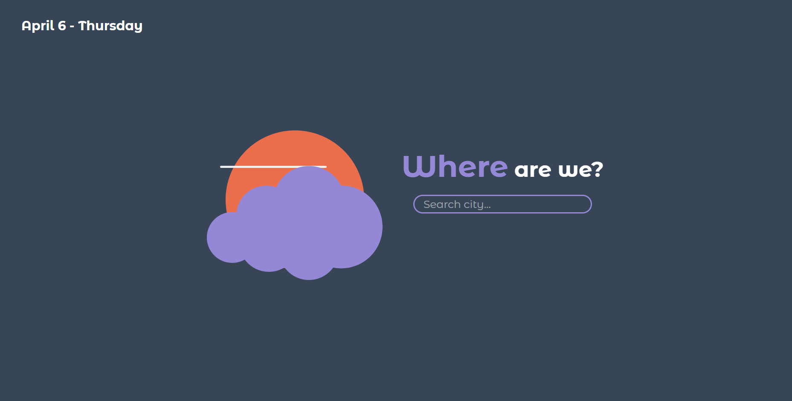
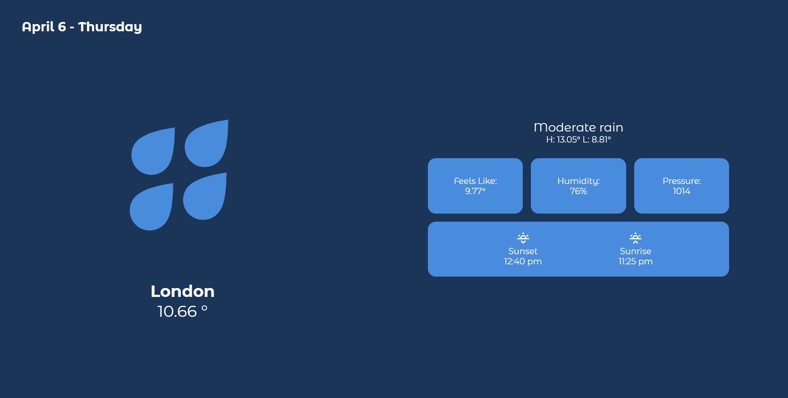

# This is a Weather App

A simple full responsive weather app that uses the [`openweathermap API`](https://openweathermap.org/api).



Take a look here [Weather App 0.1.1](https://weather-app-by-luvly.netlify.app).



Also this is a [Next.js](https://nextjs.org/) project bootstrapped with [`create-next-app`](https://github.com/vercel/next.js/tree/canary/packages/create-next-app).

## Getting Started

First, run the development server:

```bash
npm run dev
# or
yarn dev
# or
pnpm dev
```

Open [http://localhost:3000](http://localhost:3000) with your browser to see the result.
